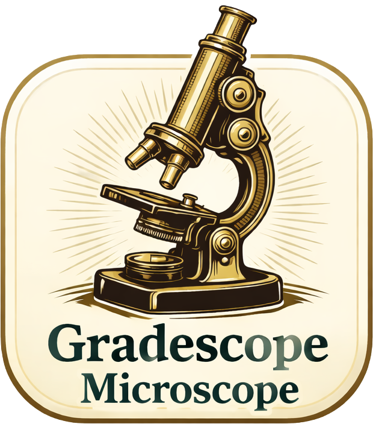

# Gradescope Microscope – A Streamlit package to analyze grading in Gradescope 

    

This package downloads the entire grading history of a Gradescope assignment and then provides tools for its analysis on either a course-wide or grader-by-grader basis.  

The package is currently under construction.

## Running Gradescope Microscope from the command line
– cd to Gradescope-Microscope folder  
– streamlit run microscope.py  

## Updating Gradescope-Microscope from the command line
– cd to Gradescope-Microscope folder  
– git pull  

